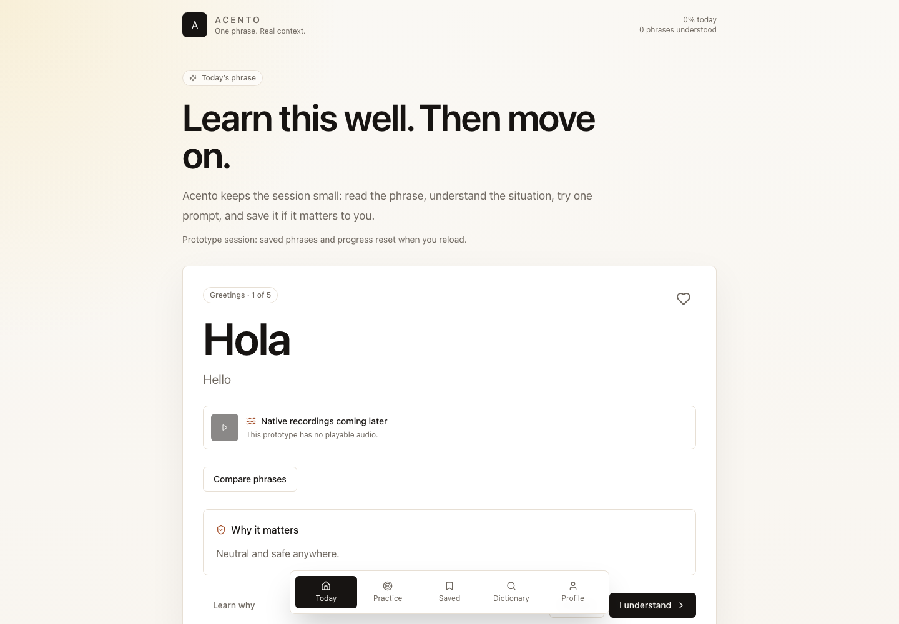
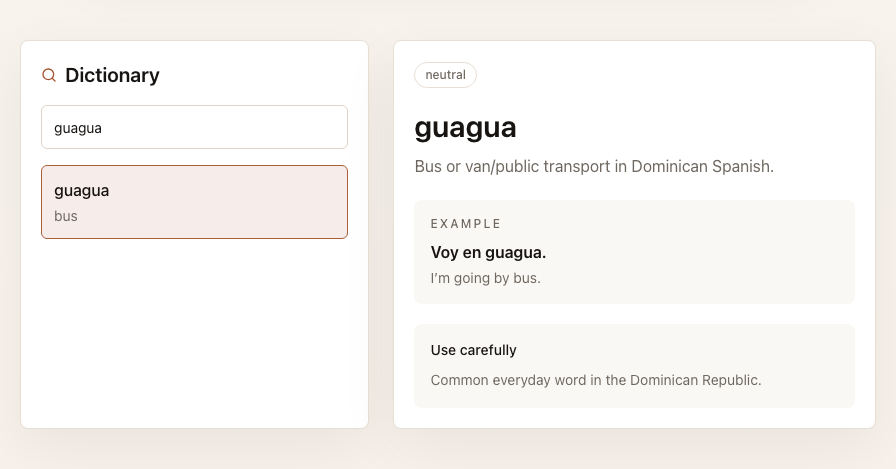

# Acento

[](https://github.com/grantmaye/acento/actions/workflows/ci.yml)

A regional-Spanish learning prototype that pairs standard and Dominican phrasing with meaning, cultural context, formality, and safe-use guidance. The web experience focuses on one phrase at a time, with an authored practice question and a small dictionary.



## What works today

- A Next.js web flow through five Greetings phrases: compare wording, reveal context, save phrases for the current session, and mark them understood.
- A lesson-authored practice quiz with explanatory feedback.
- Searchable Dominican dictionary with examples and usage notes.
- Ten lessons, fifty phrases, and fourteen dictionary entries in the content package. The web currently exposes Greetings and the dictionary; it has no lesson selector.
- A separate Spring Boot API with two public scaffold endpoints and Flyway migrations, verified against disposable PostgreSQL in CI.

Saved phrases, progress, and the daily goal are held in browser memory and reset on reload. Audio is explicitly unavailable. The web does not call the API. Authentication, durable learner state, real recordings, AI coaching, and connected native clients are future work. This is a portfolio prototype, not a production learning service or a claim of measured fluency outcomes.

## Run the web

Node 22+ and npm 10+:

```sh
npm ci
npm run content:check
npm run dev
```

Open `http://localhost:3000`. No API server, account, database, or API key is required for this experience.

## Try it

1. Read the first phrase and choose Compare phrases.
2. Open Learn why to see formality, safe audiences, and cultural guidance.
3. Save the phrase, then answer the Greetings practice question. Feedback comes from the authored lesson.
4. Choose I understand to move on and update session progress.
5. Search the dictionary for `guagua`, then inspect its example and usage note.
6. Reload to verify the documented session-only state boundary.



Screenshots are actual local Chromium captures from the browser workflow. A [mobile capture](assets/screenshots/web-mobile.png) is included. Native screenshots are not claimed because the native apps remain scaffolds.

## Learn the repository

- [Technical manual](docs/technical-manual.md): beginner-to-maintainer walkthrough, architecture, contracts, setup, exact checks, debugging labs, extension exercises with solutions, and interview questions.
- [Product story](docs/product-story.md): intended users, a clearly hypothetical scenario, value, limitations, and a 60–90 second demo narration.
- [Current architecture and future direction](docs/architecture.md).
- [Content safety and editorial review](docs/content-safety.md).
- [Dependency review and remaining tooling advisories](docs/dependency-notes.md).

| Area            | Current implementation                                                                          |
| --------------- | ----------------------------------------------------------------------------------------------- |
| Web             | Next.js, React, TypeScript, Tailwind CSS, Framer Motion                                         |
| Shared packages | Authored content, types, reusable UI, design tokens; analytics/localization extension utilities |
| API             | Java 21, Spring Boot, PostgreSQL, Flyway, OpenAPI; no learner write endpoints                   |
| Native          | SwiftUI source and Jetpack Compose scaffold; not built by CI                                    |
| Quality         | Formatting, ESLint/types, content checks, desktop/mobile Playwright, PostgreSQL API integration |

## Verify

```sh
npm run format:check
npm run lint
npm run content:check
npm run test --workspaces --if-present
npm run build
npx playwright install chromium
npm run test:e2e
```

The workspace `test` is TypeScript checking; Playwright provides browser behavior coverage. API tests are separate and require Java 21, Maven, and a running Docker engine:

```sh
mvn -f apps/api/pom.xml test
```

Root `npm test` includes both workspace checks and the API tests. The API tests fail when Docker is unavailable, rather than silently reporting skipped integration coverage. CI runs web/packages and API jobs; it does not deploy the app.

## Explore the API foundation

```sh
docker compose -f apps/api/docker-compose.yml up -d postgres
mvn -f apps/api/pom.xml spring-boot:run
```

The local database uses host port 5433. Swagger UI is `http://localhost:8080/swagger-ui.html`. `/api/public/content/dialects` lists regional identifiers; `/api/public/content/status` describes the authored content source. These are scaffold endpoints, not a connected course or learner service. The security configuration is permissive and the JWT class returns a non-authenticating preview marker.

See [deployment boundaries](docs/deployment.md) and the manual before considering hosting. [Roadmap](docs/roadmap.md) items are direction, not completed functionality.

## Contributing and license

Read [CONTRIBUTING.md](CONTRIBUTING.md) and [content safety](docs/content-safety.md) before contributing, especially regional-language content. Existing license: [MIT](LICENSE).
