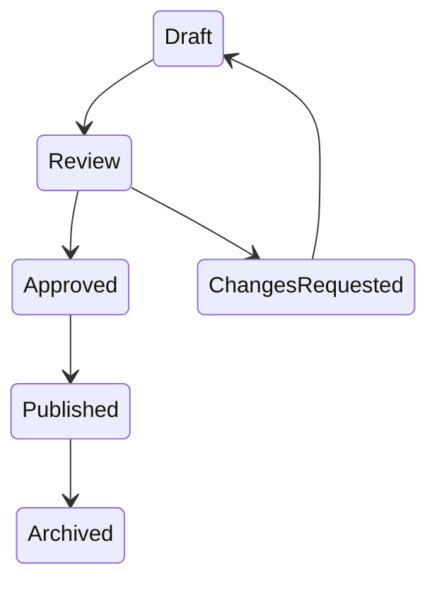

# Admin Architecture

The admin portal is not implemented yet, but the repository is structured for it.

## Admin Capabilities

- Content management.
- Lesson editor.
- Phrase approval.
- Dialect management.
- Audio uploads.
- Dictionary editor.
- User analytics.
- Feature flags.
- Moderation.

## Suggested Modules

```text
apps/web/app/admin
apps/api/src/main/java/com/acento/api/admin
packages/content/src/review
```

## Approval Flow



## Safety Requirements

- Regional content should require review.
- Slang and flirting content should require additional review.
- Audio uploads should preserve speaker metadata and consent.
- Admin actions should be audited.
