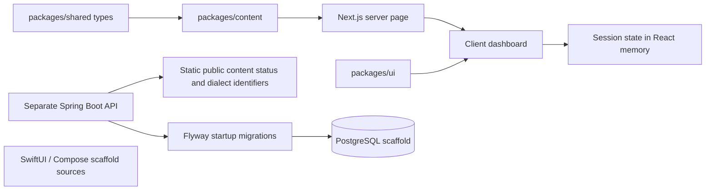

# Architecture: current implementation and direction

Acento is a monorepo with a working web learning slice, shared authored content, a separate API/database foundation, and native UI scaffolds. These components do not yet form an integrated multi-platform service. The [technical manual](technical-manual.md) traces the source and exact contracts.

## Current runtime

The web imports TypeScript content directly. It does not fetch `NEXT_PUBLIC_API_URL`. Saved phrases, completed IDs, selected dictionary entry, and the daily goal are transient client state. The content package contains ten lessons, but the current dashboard displays Greetings. The public API controller returns static scaffold information rather than loading lessons or writing learner progress.

Shared UI primitives provide the cards, buttons, and bottom navigation. `packages/design-system` defines tokens; the web Tailwind configuration currently mirrors its color values. Analytics and localization packages are extension utilities that the dashboard does not currently import. Native source files are not connected to the API and have no CI build coverage.

## Content model

[Shared types](../packages/shared/src/index.ts) separate standard phrasing from regional variants and describe formality, slang level, context, cultural notes, safe audiences, and audiences to avoid. This supports future tracks while preserving social context. The current web selects the first regional variant; an actual dialect selector still needs implementation.

Practice uses the lesson's authored `quickQuiz` prompt, options, answer, and explanation. This keeps neutral phrases from being mislabeled merely because they appear in both standard and regional fields. Structural contracts are checked by [check-content.mjs](../scripts/check-content.mjs); editorial correctness still requires human regional review.

## API foundation

Flyway creates users, progress, favorites, and content-events tables and inserts one sample user/event. There are no JPA domain entities or repositories connecting those tables to learner actions. Security permits all requests. JWT preview and AI-coach interfaces are extension points, not working authentication or AI.

The API test runs the Spring context against disposable PostgreSQL, checks the public JSON endpoints, and verifies the seed/table state. This establishes a tested foundation, not a complete learner backend.

## Future integration direction

A possible next architecture is web/native clients calling authenticated API endpoints that own durable learner state. That would require verified identities and authorization, migrations for uniqueness/integrity, validated API contracts, client synchronization/error handling, and tests across the complete request path. Redis is a possible future cache/queue dependency, not an active subsystem. AI and audio need separate implementations, source/consent review, and honest availability states.

See [roadmap](roadmap.md), [audio direction](audio-architecture.md), and [deployment boundaries](deployment.md). Planned arrows should only become current-runtime arrows after code and tests demonstrate them.
