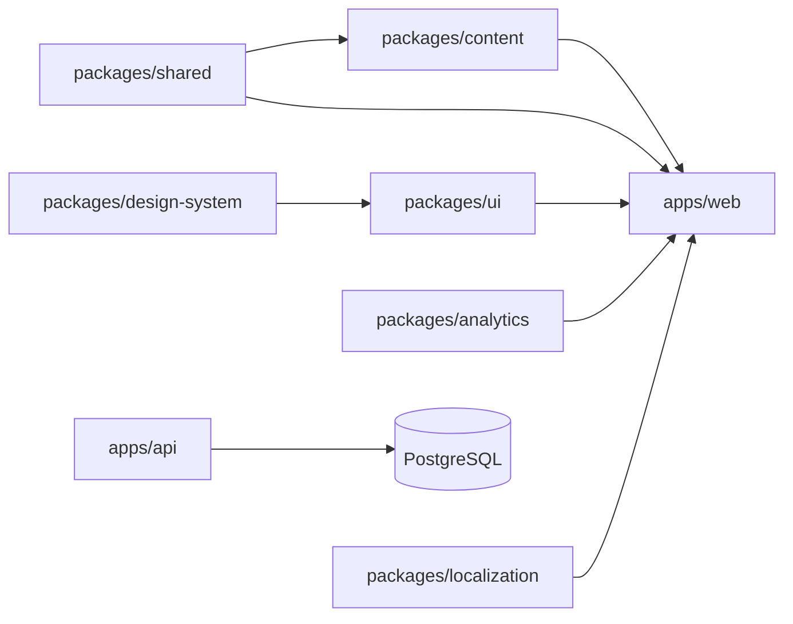
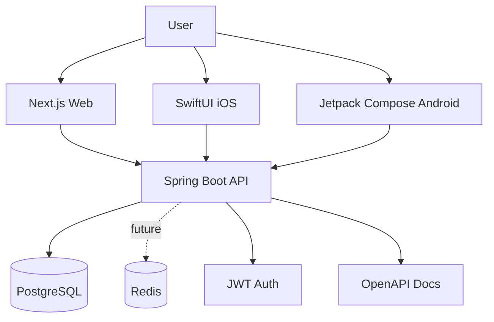

# Architecture

Acento is a multi-platform monorepo with a shared content and design foundation.

## Monorepo Boundaries



## Runtime Architecture



## Core Product Domains

- Identity: email/password, Google, Apple, anonymous guest mode.
- Onboarding: level, goals, countries, preferred dialect, daily goal, reason for learning.
- Lessons: standard vs regional phrases, explanations, culture, audio, usage tips.
- Dictionary: searchable terms with pronunciation, usage, slang level, related phrases.
- Practice: phrase trainer, flashcards, pronunciation placeholders.
- Conversations: future roleplay characters and AI coach ports.
- Progress: learning hours, vocabulary, listening, pronunciation, grammar, regional exposure.
- Admin: content management, phrase approval, dialect management, audio uploads, analytics.

## AI Extension Points

The API includes an `AiCoachPort` interface and deferred implementation. Future AI features should plug into this boundary:

- Conversation tutor.
- Roleplay.
- Pronunciation coach.
- Grammar coach.
- Vocabulary recommendations.
- Speech feedback.

No AI behavior is implemented yet.

## Content Model

Every phrase supports multiple regional variants:

```ts
type Phrase = {
  standardSpanish: string;
  regionalSpanish: {
    dialect: Dialect;
    text: string;
    pronunciation?: string;
    literalMeaning?: string;
  }[];
  formality: Formality;
  slangLevel: SlangLevel;
  context: string;
  culturalNote: string;
  safeToUseWith: string[];
  avoidWith: string[];
};
```

This prevents hardcoded Dominican-only logic while still making Dominican Spanish the flagship track.
