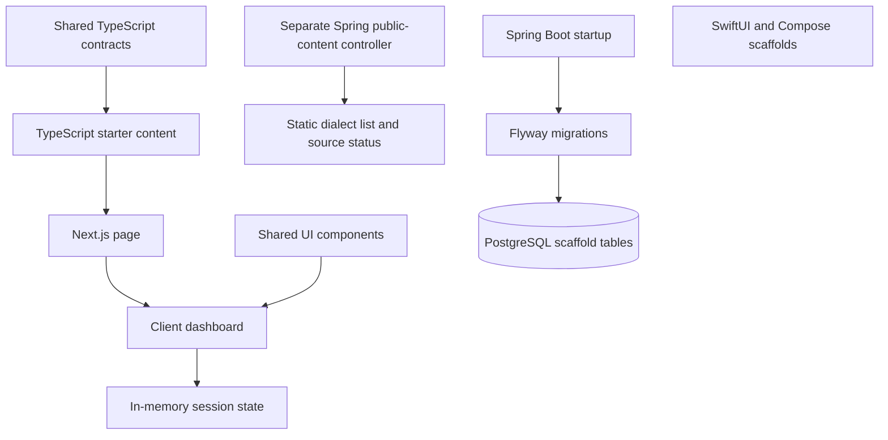

# Acento technical manual

Acento is a regional-Spanish learning prototype, centered on contextual Dominican starter content. The runnable web experience is a self-contained Next.js application. The repository also contains a Spring Boot/PostgreSQL foundation and native UI scaffolds. Those pieces are not yet connected to the web learning session. This manual describes the implemented state; the [product story](product-story.md) explains its intended benefit without inventing customers or outcomes.

## 1. What you can actually do

On the web home page, read one phrase from the Greetings lesson, compare standard and Dominican wording, reveal context/formality guidance, save the phrase, answer the lesson's authored quiz, and move to the next phrase. Search the dictionary, select a term, and inspect an example and usage warning. Adjust the temporary daily goal between 5, 10, and 15 minutes.

The session is deliberately small. The content package contains **10 lessons, 50 phrases, and 14 dictionary entries**, but the current web interface selects `greetings` (or the first lesson as fallback); it is not a ten-lesson navigation system. Progress and saved phrases live in React memory and reset on reload. The bottom navigation scrolls to sections on one page. It does not change application routes or synchronize with scrolling.

Audio is visibly unavailable. The data contains `audio://placeholder/...` references, not playable recordings. Comparing phrases is an explicit text action; clicking a pretend play button no longer marks a phrase as listened to. Practice uses `lesson.quickQuiz`, so it does not wrongly label the first neutral “Hola” as casual-only or offer two identical “Hola” choices. The quiz belongs to the lesson and remains the same as its phrases advance. See [product.tsx](../apps/web/app/product.tsx), [AudioControls](../packages/ui/src/audio-controls.tsx), and [content](../packages/content/src/index.ts).

## 2. Concepts before frameworks

A **dialect** here is a regional track identifier such as `dominican`, not a claim that every speaker uses identical wording. **Formality** describes a social register (`formal`, `neutral`, `casual`, `intimate`, `risky`). **Slang level** is a separate field (`none`, `light`, `medium`, `heavy`). A phrase can be regional yet neutral; those concepts must not be collapsed.

A **monorepo** holds multiple applications and packages together. An npm **workspace** lets those packages import one another locally. A **server component** can prepare content before it reaches the browser; a **client component** handles interactive state. **Flyway** applies numbered SQL migrations to the API database. A **port** is an interface for a future implementation, such as AI coaching; declaring one does not implement the feature.

Start your source reading with [shared types](../packages/shared/src/index.ts), then one Greetings phrase in [content](../packages/content/src/index.ts), then [page.tsx](../apps/web/app/page.tsx) and [product.tsx](../apps/web/app/product.tsx). This order connects vocabulary, authored data, and visible behavior.

## 3. Setup by component

### Web only

Use Node 22 or newer and npm 10 or newer. No Java, database, API key, or external account is necessary to run the web prototype.

```sh
npm ci
npm run content:check
npm run dev -- --hostname 127.0.0.1 --port 43104
```

Open `http://127.0.0.1:43104`. To exercise the production web build:

```sh
npm run build
npm run start --workspace @acento/web -- --hostname 127.0.0.1 --port 43104
```

`NEXT_PUBLIC_API_URL=http://localhost:8080` in [apps/web/.env.example](../apps/web/.env.example) is a reserved integration setting. The current page does not read it or fetch the API. Setting it does not enable login, saving, or progress sync. Next.js loads web `.env.local` from `apps/web`; a root environment example is not automatically a web configuration loader.

### API and database, separately

Use Java 21, Maven, and a running Docker engine. From the repository root:

```sh
docker compose -f apps/api/docker-compose.yml up -d postgres
mvn -f apps/api/pom.xml spring-boot:run
```

Default local PostgreSQL is at host port **5433**; the container listens on 5432. API defaults are `http://localhost:8080`, local database `acento`, and local-only user/password `acento`. These checked-in values are disposable development defaults, not production credentials. The API example and `application.yml` use the same 5433 host port. Docker Compose also defines Redis, but the API has no implemented Redis integration and web use does not require it.

For another environment, supply environment variables explicitly:

```dotenv
SPRING_DATASOURCE_URL=jdbc:postgresql://HOST:PORT/DATABASE
SPRING_DATASOURCE_USERNAME=DATABASE_USER
SPRING_DATASOURCE_PASSWORD=REPLACE_LOCALLY
SERVER_PORT=8080
ACENTO_JWT_ISSUER=YOUR_ISSUER
ACENTO_JWT_SECRET=REPLACE_LOCALLY
```

Spring Boot does not automatically source `.env.example` or arbitrary `.env` files. Export values in your shell or configure the process environment. Docker Compose's `--env-file` configures interpolation for Compose; it does not export variables into a separately launched Maven process. `ACENTO_JWT_SECRET` is currently unused for signing. Supplying a secret does not enable JWT authentication.

Stop only the containers you started when finished:

```sh
docker compose -f apps/api/docker-compose.yml stop postgres
```

Avoid volume deletion unless you intentionally want to erase local database state.

### Native foundations

[apps/ios](../apps/ios/README.md) contains SwiftUI source but no Xcode project/target. [apps/android](../apps/android/README.md) contains a Gradle/Compose scaffold but no committed Gradle wrapper or CI build. Neither is claimed as a verified distributable app, connected client, or equivalent of the web workflow. Promoting them into working targets is separate project work; the current CI validates neither native platform.

## 4. Source map and actual architecture

| Path                                                                                                                     | Current responsibility                                                                     |
| ------------------------------------------------------------------------------------------------------------------------ | ------------------------------------------------------------------------------------------ |
| [apps/web/app/page.tsx](../apps/web/app/page.tsx)                                                                        | Imports authored content and passes it to the client dashboard                             |
| [apps/web/app/product.tsx](../apps/web/app/product.tsx)                                                                  | Phrase index, saved/completed sets, lesson quiz, dictionary, temporary goal                |
| [apps/web/app/globals.css](../apps/web/app/globals.css), [tailwind.config.ts](../apps/web/tailwind.config.ts)            | Warm paper, sienna accents, layout, and dark-class styling                                 |
| [packages/shared](../packages/shared/src/index.ts)                                                                       | Phrase, Lesson, DictionaryEntry, dialect, and profile types                                |
| [packages/content](../packages/content/src/index.ts)                                                                     | Authored lessons and dictionary, helper-generated phrases and IDs                          |
| [packages/ui](../packages/ui/src/index.ts)                                                                               | Reusable cards, buttons, navigation, lesson card, progress ring, unavailable-audio display |
| [packages/design-system](../packages/design-system/src/index.ts)                                                         | Token definitions; web Tailwind currently mirrors color values rather than importing them  |
| [packages/analytics](../packages/analytics/src/index.ts), [packages/localization](../packages/localization/src/index.ts) | Typed extension utilities, currently not wired into the dashboard                          |
| [scripts/check-content.mjs](../scripts/check-content.mjs)                                                                | Executable content count, uniqueness, context, and quiz checks                             |
| [ContentController.java](../apps/api/src/main/java/com/acento/api/content/ContentController.java)                        | Two public scaffold endpoints                                                              |
| [SecurityConfig.java](../apps/api/src/main/java/com/acento/api/config/SecurityConfig.java)                               | Permissive scaffold security, empty in-memory user store                                   |
| [JwtTokenService.java](../apps/api/src/main/java/com/acento/api/auth/JwtTokenService.java)                               | Non-authenticating preview record, no token signing                                        |
| [DeferredAiCoach.java](../apps/api/src/main/java/com/acento/api/ai/DeferredAiCoach.java)                                 | Explicitly unavailable AI response                                                         |
| [db/migration](../apps/api/src/main/resources/db/migration)                                                              | Flyway schema and sample seed                                                              |
| [playwright.config.ts](../playwright.config.ts), [learning.spec.ts](../tests/e2e/learning.spec.ts)                       | Desktop/mobile browser contract                                                            |



There is intentionally no web-to-API arrow in this current-state diagram. The web page serializes content to the client; no authenticated server session exists. The native scaffolds are also disconnected. For intended future integration, see the clearly labeled [architecture direction](architecture.md).

## 5. Contracts and invariants

A [Phrase](../packages/shared/src/index.ts) has an ID, owning lesson ID, English meaning, standard Spanish, an array of regional variants, formality, slang level, context, cultural note, safe/avoid audiences, examples, tags, and optional audio references. A Lesson adds description, level, duration, category, dialect focus, comparative guidance, flashcards, dialogue, practice prompts, a quick quiz, and related dictionary IDs. A DictionaryEntry adds meaning, pronunciation, examples, translation, formality, usage/culture notes, safe/risky contexts, and related phrase labels.

Dictionary IDs are generated from terms using Unicode normalization, accent removal, and hyphenated spaces. For example, `qué lo qué` becomes `que-lo-que`. Regional variants are arrays so future content can distinguish dialects. The current dashboard chooses element zero; it does not implement dialect selection. Adding a new variant alone does not make another track available.

The content checker requires at least ten lessons, at least five phrases and flashcards per lesson, unique lesson/phrase IDs, consistent phrase-to-lesson membership, standard text, a Dominican variant, context/cultural guidance, a safe audience, and an unambiguous quiz answer with explanation. It also checks the fourteen required dictionary terms. These are structural checks, not a substitute for fluent regional editorial review. See [content safety](content-safety.md).

The dashboard derives saved phrases from a `Set` of phrase IDs, preventing duplicate saves. It derives progress from completed IDs divided by the current lesson's phrase count. Moving on marks a phrase completed, clears comparison/practice/detail state, advances cyclically, and scrolls back to Today. Repeating a phrase does not inflate completion beyond the number of unique phrases. This is a self-reported completion indicator, not measured comprehension or fluency.

Dictionary search lowercases and trims a substring query over term, meaning, English equivalent, and standard equivalent. It shows six terms initially and at most eight search results. Search is not accent-folded. Selecting a term controls its detail pane; changing the search does not automatically change the selected detail. An empty result set is explicitly announced.

## 6. API and database: foundation, not learner persistence

The API exposes:

```sh
curl -sS http://localhost:8080/api/public/content/dialects
curl -sS http://localhost:8080/api/public/content/status
curl -sS http://localhost:8080/v3/api-docs
```

The first returns nine regional identifiers beginning with `dominican`; it is a list of planned/supported contract identifiers, not nine authored courses. The second returns `{ "source": "starter-content", "note": "Content is authored in packages/content and prepared for API ingestion." }`. Swagger UI is `/swagger-ui.html`. There are no lesson CRUD, favorites, progress, login, or AI HTTP endpoints.

Flyway [V1](../apps/api/src/main/resources/db/migration/V1__init.sql) creates:

| Table            | Stored contract and important gaps                                                                                                        |
| ---------------- | ----------------------------------------------------------------------------------------------------------------------------------------- |
| `app_users`      | UUID key, unique nullable email, display name, provider, dialect preference, anonymous flag, creation time                                |
| `user_progress`  | UUID key, user foreign key, lesson ID, status, confidence integer, update time; no lesson table/foreign key or uniqueness per user/lesson |
| `favorites`      | UUID key, user foreign key, content type/ID, creation time; no uniqueness per user/content                                                |
| `content_events` | UUID key, event type, optional aggregate ID, actor text, detail text, creation time                                                       |

[V2](../apps/api/src/main/resources/db/migration/V2__seed.sql) inserts one sample user and one content-ready event. It does not ingest the TypeScript lessons or create learner progress. There are no JPA entities/repositories using these tables. Hibernate's `ddl-auto: validate` is not proof of a complete domain mapping when no entities exist.

`SecurityConfig` currently permits every request and disables CSRF. The empty user store and HTTP Basic configuration do not establish a usable sign-in flow. `JwtTokenService` returns a `TokenPreview` containing a literal `jwt-signing-not-enabled-yet` marker. `DeferredAiCoach` returns an unavailable preview. Neither represents authentication or actual AI. Do not expose this foundation as a production learner service merely by setting environment variables.

## 7. Verification and what each command proves

From the repository root:

```sh
npm ci
npm run format:check
npm run lint
npm run content:check
npm run test --workspaces --if-present
npm run build
npx playwright install chromium
PORT=43104 npm run test:e2e
mvn -f apps/api/pom.xml test
```

The last command requires Java 21, Maven, and Docker for a disposable PostgreSQL 16 Testcontainer. Root `npm test` also invokes the API tests after workspace checks. If Docker is unavailable, integration tests now fail rather than silently skip. `mvn -f apps/api/pom.xml test-compile` can confirm compilation, but it is not integration execution.

`lint` runs ESLint for web and TypeScript checks in packages. The web workspace's `test` script is `tsc --noEmit`, not a unit suite. `build` runs Next.js and package type checks. The content check validates authored-data structure. Browser tests verify reading, comparison, unavailable audio, saved phrases, authored quiz feedback, progress, dictionary search/empty state, and reset on reload in desktop and mobile viewports. They start their own production server and refuse to reuse an existing one; select an unused port.

[API tests](../apps/api/src/test/java/com/acento/api/AcentoApiApplicationTests.java) start the Spring context, assert the two public JSON contracts, and verify migrations produce one user, no progress/favorites, and one content event. They do not establish login, write APIs, load capacity, or native correctness. [CI](../.github/workflows/ci.yml) runs independent web/packages and API jobs on PRs and main pushes, including content and browser gates. It contains no deployment step.

Dependency hygiene is time-sensitive. At the October 2026 portfolio pass, compatible Next.js/security updates removed runtime audit findings, while the full npm audit still reported nine findings through Tailwind 3/ESLint glob and selector tooling. See [dependency notes](dependency-notes.md) for exact commands, advisory links, and limits. A clean npm runtime audit is not a Java dependency audit or a guarantee of application security.

## 8. Debugging and failure labs

| Lab                          | Procedure and expected result                                                                                                                                                     |
| ---------------------------- | --------------------------------------------------------------------------------------------------------------------------------------------------------------------------------- |
| Session persistence boundary | Save a phrase and mark it understood, then reload. Saved list and progress reset; the UI explicitly warns about this. If persistence is expected, it needs a new storage design.  |
| Quiz correctness             | Choose `KLK` for the Greetings interview question: expect “Try another answer.” Choose `Buenos días`: expect “Good fit.” Both show the authored formal-context explanation.       |
| Audio boundary               | The audio button is disabled and says unavailable. “Compare phrases” reveals text without implying playback. No audio network request should occur.                               |
| Empty dictionary             | Search an impossible term. Expect “No matching terms” while the previously selected detail remains until another selection.                                                       |
| Missing database             | Stop only your local PostgreSQL service, then start the API. Expect startup failure, not an empty successful learner API. Check datasource host port 5433 and exported variables. |
| Missing Docker in tests      | Run API integration without Docker. Expect failure, not a green skipped suite. Check the Docker daemon, not just whether the CLI is installed.                                    |
| Broken content               | In a temporary local edit, duplicate a phrase ID or set a quiz answer outside its options. `npm run content:check` must fail. Revert the experiment before committing.            |

For browser failures inspect `test-results` and open a trace with `npx playwright show-trace PATH_TO_TRACE.zip`. Java reports are under `apps/api/target/surefire-reports`. An API response listing dialects does not mean the web fetched those dialects; inspect the browser network panel and current source before diagnosing a connection that does not exist.

## 9. Tradeoffs and extension exercises

Authored TypeScript content gives a fast, reproducible web demo without a backend. It also means content is bundled with the application and editorial updates require a build. Keeping progress in memory avoids an invented account model but makes “Saved” temporary. A single greetings flow is easy to learn but does not expose the full starter corpus. Design tokens are partly mirrored in Tailwind, so token changes currently need consistency checks.

**Exercise: make saved phrases survive reload locally.** **Solution:** define a versioned local-storage schema, validate IDs against current content, load after hydration, handle storage exceptions, and test malformed data and reset. Label it device-local; do not imply account synchronization. This is an extension, not present behavior.

**Exercise: add lesson selection.** **Solution:** hold a selected lesson ID, derive phrase progress per lesson, reset phrase index and quiz state on switching, and test empty/fallback lessons. Do not reuse the single global completed set as the denominator for every lesson.

**Exercise: connect favorites to the API.** **Solution:** implement verified identity and authorization first; add an appropriate unique `(user_id, content_type, content_id)` constraint via a new Flyway migration; expose validated endpoints; use explicit loading/error/conflict states in the web. Do not turn permissive scaffold routes into unauthenticated personal-data writes.

**Exercise: add a real recording.** **Solution:** obtain reviewed, consented audio with dialect/source metadata, replace placeholder references with trusted media URLs, implement playback events and error states, and test unavailable media. Show listening progress only when media actually plays. Preserve text access for users who cannot hear the recording.

## 10. Interview questions

**What is complete today?** A working web learning slice with authored content and transient state, plus tested public API scaffolding and migrations. Native clients and web/API integration remain foundations.

**Why separate formality and dialect?** Regional wording does not automatically mean slang or informality. The model keeps social context explicit and the UI should honor those distinctions.

**What caused the quiz bug?** The earlier UI synthesized answers from phrase strings and always preferred the regional string. Identical standard/regional words became duplicate choices with misleading feedback. Using the authored lesson quiz restores an unambiguous contract.

**Does a JWT class mean authentication exists?** No. This one creates a preview marker without signing, verification, identity issuance, or protected endpoints.

**What does the API migration test prove?** That the Spring application starts against real disposable PostgreSQL and the schema/seed contracts hold. It does not prove learner writes that have not been implemented.

**What should be built before claiming production readiness?** Identity and authorization, reviewed content operations, durable learner state, real audio, privacy and retention choices, recovery/observability, and verified native targets where required. Product claims should advance only with their corresponding implementation and evidence.
